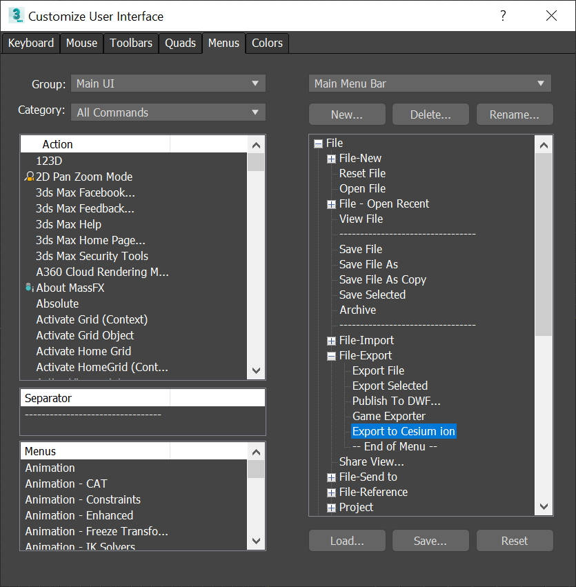
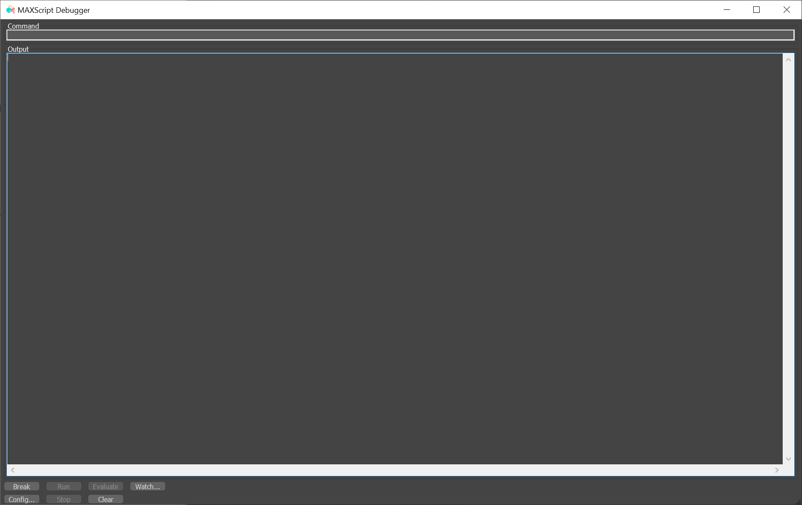
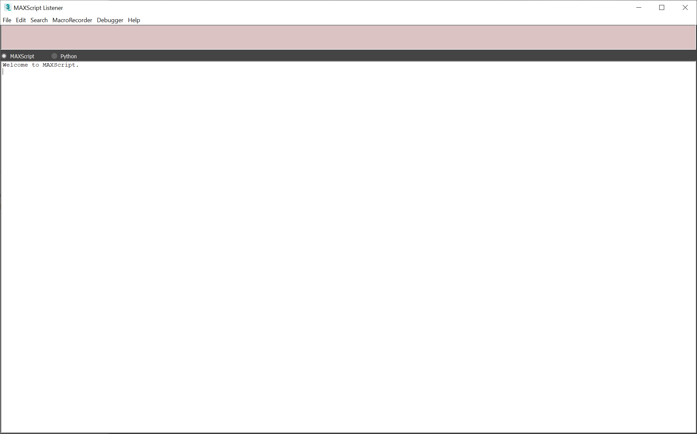

# Development

Follow these steps to run the addon directly from source so that your changes will be reflected in Blender.

1. **[REPLACEME]** COMPLETE INSTRUCTIONS
1. Discuss how to get the repository running on any operating system (including Unix, Linux and Windows). The steps should outline from cloning the repository to having the application running in a development state.

3ds Max runs only on Windows, therefore the following documention is for Windows only.

The project consists of two parts:
- a .NET Core project which handles all network interaction.
- maxScripts which integrate the .NET project and create the user interface

This guide covers how to run maxScript and build .NET in Visual Studio Code.
Template task.json and launch.json files are included in the repository.

#### Requirements
- [.NET Core SDK](https://dotnet.microsoft.com/download)
- [AWS SDK for .NET](https://aws.amazon.com/sdk-for-net/)

#### Visual Studio Code

1. Clone the repository.
1. Open the repository as workspace in VS Code.
1. In VS Code install the *Language MaxScript* extension. (*ctrl + shift + x*)
1. [optional] Set a shortcut to run maxScripts by going to *File->Preferences->Keyboard Shortcuts* and set a shortcut for *Tasks: Run Task*

#### Running the plugin

Create the Windows Environment Variable ADSK_APPLICATION_PLUGINS and set it to your repository.
The plugin should now be loaded on start-up.

To manually run the plugin:
1. Start 3ds Max (to run scripts from VS Code 3ds Max has to be open)
1. Open *PluginPackage/PreStartupScripts/cesiumPlugin.ms*.
1. Run it with the Task **Execute Script in 3ds Max**.
1. Open *PluginPackage/Widgets/nameRequiredWidget.ms* and run it. This creates a warning popup.
1. Open *PluginPackage/Widgets/mainWidget.ms* and run it. This creates the Exporter popup window.
1. Next open *PluginPackage/PostStartupScripts/addMenus.ms* and run it. This will add the menu item in 3ds Max under *File->Export*.
Running these files in a different order will create an error in 3ds Max.

#### Updating popups

To update the popup simply rerun the .ms file which creates it (for example *mainWidget.ms*).

#### Delete old menus

When you close and reopen 3ds Max it can happen that the previously created export menu item will get lost. In that case it will still appear in there but with the text *Missing: exportButton'mxs docs* and without any functionality. To delete it open *Customize->Customize User Interface*.


<p align="center">
    The Customize User Interface Dialog
</p>

Open the *Menus* tab and delete it in the panel on the right under *File->File-Export* by selecting it and pressing *delete* on your keyboard or reset all menus by pressing the *Reset* button. Afterwards repeat the steps to run the plugin.

#### Updating .NET

Press *crtl + shift + b*. This builds the project for **Release** and places the binaries in the right folder (./PluginPackage/C#/).


## Debugging
### maxScript
Code can be debugged using the
```python
print "something"
```
command or by placing a 
```python
break()
```
in the code. The later one opens the [MAXScript Debugger](http://help.autodesk.com/view/3DSMAX/2020/ENU/?guid=GUID-E04AB16E-D5C8-4B00-81A6-E3945E97A1EB).

<p align="center">
    The MAXScript Debugger 
</p>

While in the debugger enter **?** as command to see a list of available commands.

The MAXScript Debugger and the [MAXScript Listener](http://help.autodesk.com/view/3DSMAX/2020/ENU/?guid=GUID-C8019A8A-207F-48A0-985E-18D47FAD8F36) can also be opened via the *Scripting* menu in 3ds Max.


<p align="center">
    The MAXScript Listener 
</p>

The MAXScript Listener shows errors and can be used to run maxScript snippets (similar to a python console). The content of a variabel can be displayed by typing the name and pressing *Enter*.
### .NET

1. Open *tasks.json* and change the arguments in brackets **<>** with the correct path. The first argument is the funtion name, the others are the function parameters. Instead of using arguments you can also change the main function in *server.cs* to do the desired task. But don't forget to change it back afterwards.
1. Go to the Debug Panel (*crtl + shift + d*) and run in Debug Mode (*F5*).

## Releases

#### Create the release package

1. Pull down the latest master branch: `git pull origin master`
1. Modify `PluginPackage/PackageContents.xml` and increment the minor version only:
   - `"AppVersion="1.0.0"` becomes `AppVersion="1.1.0"`
1. Proofread and update CHANGES.md to capture any changes since last release.
1. Commit and push these changes directly to master.
1. Make sure the repository is clean `git clean -xdf`. __This will delete all files not already in the repository.__
1. Pack PluginPackage into `io-cesium-ion-vx.x.x.zip` (were x.x.x will be the version)

#### Testing

1. Reset the User Interface in 3ds max as described in [Delete old menus](#delete-old-menus)
1. Close 3ds max
1. Delete the tokenfile at *%LOCALAPPDATA%/Autodesk/3dsMax/\<ReleaseNumber> - 64bit/ENU/plugcfg_ln/cesiumIonToken*
1. Delete all files named *cesiumion\<number>.fbx* and *progress\<number>.log* in *%LOCALAPPDATA%/Autodesk/3dsMax/\<ReleaseNumber> - 64bit/ENU/temp/*
1. Start 3ds max
1. Try out the pluging
1. Provoke errors by interrupting the internet connection while uploading etc.

#### Release

1. Test the plugin.
1. Create and push a tag, e.g.,

   -   `git tag -a 1.1 -m '1.1 release'`
   -   `git push origin 1.1` (do not use `git push --tags`)

1. Publish the release zip file to GitHub

   -   [Create new release](https://github.com/AnalyticalGraphicsInc/cesium-ion-3ds-max-plugin/releases/new).
   -   Select the tag you use pushed
   -   Enter `Cesium ion 3ds Max 1.x` for the title
   -   In the description, include the date, list of highlights and permalink to CHANGES.md, which is in the format https://github.com/AnalyticalGraphicsInc/cesium-ion-blender-addon/blob/1.xx/CHANGES.md, where 1.xx is the version number.
   -   Attach the `io-cesium-ion-vx.x.x.zip` you generated during the build process.
   -   Publish the release

1. Tell the outreach team about the new release to have it included in the monthly release announcements/blog post and on social media.
1. Update cesium.com with a link to the latest release zip.
