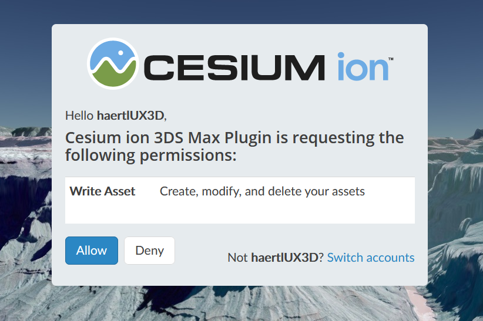

  

# Cesium ion 3ds Max Plugin

The Cesium ion 3ds Max plugin enables you to effortlessly export your models to your Cesium ion account and stream 3D Tiles to CesiumJS and other applications.

Leveraging Cesium ion and the power of 3D Tiles, even multi-gigabyte models can be streamed to any device without having to download the entire tileset up front. By visualizing 3D Tiles with CesiumJS, you can fuse your models with other datasets, add geospatial context to place it at a real world location, or overlay additional details and analysis.

Learn more at https://cesium.com.

    Kokura Castle (left) loaded into Blender and (right) fused with Cesium World Terrain and imagery in CesiumJS after being tiled with ion.

## Installation and Usage

TODO: Autodesk App Store link here.

For development, see [Developer Guide](./Documentation/DeveloperGuide/README.md)

## Tutorial

To export your model to Cesium ion go to **File > Export > Export to Cesium ion...**.

The first time you use the plugin, you will need to authorize the plugin to access your Cesium ion account. The plugin automatically launches the browser page. You may be asked for your name and password. If you are already logged in, a permissions window similar to the one below will appear immediately.

Click Allow, and the next page will confirm that permission has been granted. You can close your browser window and return to 3ds Max.

The Cesium ion exporter window in 3ds Max will look like:

- **Name**: (Required) A name for the ion asset you are uploading.
- **Description**: An optional description.
- **Attribution**: Any attribution you would like to appear when this asset is loaded into client visualization engines.
- **Model Type**: (Required) A hint to ion about the type of model you are uploading. For most 3ds Max models, select **3D Model**. If you are loading a mesh that originated from a 3D scan, LIDAR, or photogrammetry processes, select **3D Capture** instead.
- **Use WebP images**: If enabled, will produce a tileset with WebP images, which are typically 25–34% smaller than equivalent JPEG images, leading to faster streaming and reduced data usage. 3D Tiles produced with this option requires a client that supports the glTF EXT_texture_webp extension, such as CesiumJS 1.54 or newer, and a browser that supports WebP, such as Chrome or Firefox 65 and newer.
- **Export only selected**: If selected, only selected objects will be uploaded.

Next click **Upload to Cesium ion**

At this point a progress bar will appear and the model will be uploaded to Cesium ion.
When the upload is completed, 3ds Max will launch Cesium ion where you can view the asset in the ion dashboard.

### Note on Textures and Baking

Cesium ion requires all Autodesk materials to be baked to textures. If on Cesium ion the materials are not rendered correctly, you will need to bake the materials to textures in 3ds Max before exporting.

Follow the [Workflow: Texture Baking by Autodesk](https://knowledge.autodesk.com/support/3ds-max/learn-explore/caas/CloudHelp/cloudhelp/2020/ENU/3DSMax-Rendering/files/GUID-37414F9F-5E33-4B1C-A77F-547D0B6F511A-htm.html) guide from Autodesk to bake the materials to textures.

## Contributing

Interested in contributing? See [CONTRIBUTING.md](CONTRIBUTING.md). :heart:
